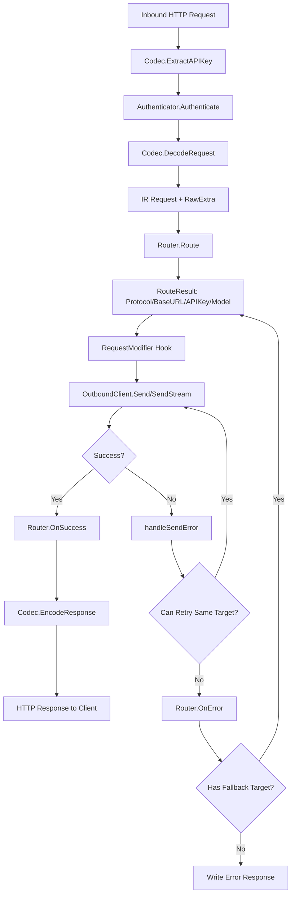

# llmapimux 技术文档

> **版本**: v0.x (开发中)  
> **语言**: Go  
> **模块路径**: `github.com/llmapimux/llmapimux`  
> **许可证**: MIT

---

## 目录

1. [项目概述](#1-项目概述)
2. [架构设计](#2-架构设计)
3. [核心数据流](#3-核心数据流)
4. [中间表示 (IR) 体系](#4-中间表示-ir-体系)
5. [协议编解码器 (Codec)](#5-协议编解码器-codec)
6. [协议转换器 (Converter)](#6-协议转换器-converter)
7. [出站客户端 (Outbound Client)](#7-出站客户端-outbound-client)
8. [路由与容错系统](#8-路由与容错系统)
9. [流式传输 (SSE)](#9-流式传输-sse)
10. [RawExtra 侧通道机制](#10-rawextra-侧通道机制)
11. [RequestModifier 钩子](#11-requestmodifier-钩子)
12. [AttemptController 尝试控制](#12-attemptcontroller-尝试控制)
13. [可观测性 (Stats)](#13-可观测性-stats)
14. [协议差异与映射规则](#14-协议差异与映射规则)
15. [文件结构详解](#15-文件结构详解)
16. [构建与测试](#16-构建与测试)

---

## 1. 项目概述

**llmapimux** 是一个 Go 语言 SDK，提供 `http.Handler` 实现，用于在 4 种主流 LLM API 协议之间进行请求/响应的代理与转换：

| 协议 | 标识 | API 路径 |
|------|------|----------|
| OpenAI Chat Completions | `openai_chat` | `/v1/chat/completions` |
| OpenAI Responses API | `openai_responses` | `/v1/responses` |
| Anthropic Messages | `anthropic` | `/v1/messages` |
| Gemini GenerateContent | `gemini` | `/v1beta/models/{model}:generateContent` |

**核心设计理念**：采用统一的中间表示（IR, Intermediate Representation）管道，所有协议的请求先解码为 IR，再从 IR 编码为目标协议格式。通过 2N 个适配器（N 个解码器 + N 个编码器）覆盖 N²=16 种协议组合路径，避免了 N² 个点对点转换器的爆炸性复杂度。

**典型使用场景**：
- 统一网关：客户端使用任意协议接入，后端路由到不同的 LLM 提供商
- 协议适配：将 Anthropic SDK 请求透明转发到 OpenAI 后端
- 负载均衡与容错：在多个上游提供商之间实现自动故障转移

---

## 2. 架构设计

### 2.1 整体架构

```
┌─────────────────────────────────────────────────────────────────┐
│                        客户端请求                                │
│  (OpenAI Chat / OpenAI Responses / Anthropic / Gemini)          │
└──────────┬──────────┬──────────────┬───────────────┬──────────────┘
           │          │              │               │
     ┌─────▼────┐ ┌───▼────┐ ┌──────▼─────┐ ┌──────▼─────┐
     │ OpenAI   │ │ OpenAI │ │ Anthropic  │ │  Gemini    │
     │ Chat     │ │ Resp.  │ │ Codec      │ │  Codec     │
     │ Codec    │ │ Codec  │ │            │ │            │
     └─────┬────┘ └───┬────┘ └──────┬─────┘ └──────┬─────┘
           │          │              │               │
           └──────────┴──────┬───────┴───────────────┘
                             │
                    ┌────────▼────────┐
                    │  DecodeRequest   │  ← 协议特定 JSON → IR Request
                    │  (+ RawExtra)    │
                    └────────┬────────┘
                             │
                    ┌────────▼────────┐
                    │  Router.Route()  │  ← 决定目标协议/URL/模型/API Key
                    └────────┬────────┘
                             │
                    ┌────────▼────────┐
                    │ RequestModifier  │  ← 钩子: 设置 OutboundExtra
                    └────────┬────────┘
                             │
                    ┌────────▼────────┐
                    │  EncodeRequest   │  ← IR → 目标协议 JSON (+ OutboundExtra 合并)
                    └────────┬────────┘
                             │
                    ┌────────▼────────┐
                    │  OutboundClient  │  ← HTTP 发送 (Send / SendStream)
                    │  .Send/SendStream│
                    └────────┬────────┘
                             │
                    ┌────────▼────────┐
                    │  DecodeResponse │  ← 上游 JSON → IR Response / StreamEvent
                    └────────┬────────┘
                             │
                    ┌────────▼────────┐
                    │  EncodeResponse │  ← IR → 入站协议 JSON
                    │  (+ RawExtra     │     (同协议时合并回 RawExtra)
                    │   merge)         │
                    └────────┬────────┘
                             │
              ┌──────────────┴──────────────┐
              │                             │
        ┌─────▼──────┐              ┌──────▼──────┐
        │ Non-Stream  │              │   Stream    │
        │ JSON 响应   │              │   SSE 响应  │
        └────────────┘              └─────────────┘
```

### 2.2 核心设计原则

1. **统一 IR 管道**：所有协议路由经过 `decode → IR (+ RawExtra) → encode`，不存在同协议原始透传路径
2. **2N 适配器覆盖 N² 路径**：4 个解码器 + 4 个编码器 = 8 个适配器覆盖 16 种协议组合
3. **静默丢弃不可表示字段**：跨协议时，目标协议无法表示的字段被静默丢弃
4. **单次 IR 解码 + 多次重编码**：故障转移时 IR 只解码一次，每次尝试重新编码
5. **流式边界不可逆**：一旦 HTTP 200 头已写入客户端，不再允许故障转移

---

## 3. 核心数据流

### 3.1 请求处理主流程

`Handler.ServeHTTP()` 的完整执行流程：

```
1. ExtractAPIKey        → 从请求头提取 API Key
2. Authenticate         → 可选的身份验证
3. ReadAll(body)        → 读取请求体
4. DecodeRequest        → 协议特定 JSON → IR Request（设置 InboundProtocol）
5. Build RouteInfo      → 构建路由信息（RequestID、Model、Stream、HasTools 等）
6. Router.Route()       → 获取首个目标 RouteResult
7. populateRawExtra     → 同协议时按需提取 RawExtra
8. Set Model            → 原始模型保存到 OriginalModel，路由模型赋给 Model
9. OnRequestStart       → 触发统计事件
10. 进入重试循环         →
    a. NewClient(target.Protocol)  → 获取出站客户端
    b. req.OutboundExtra = nil      → 重置 OutboundExtra
    c. RequestModifier(req, target) → 调用修改器钩子
    d. Acquire()                    → 尝试控制器准入
    e. Send / SendStream            → 执行出站请求
    f. 成功 → OnSuccess → EncodeResponse → 写入客户端
    g. 失败 → handleSendError → 尝试同目标重试 / 故障转移到下一目标
```

### 3.2 数据流图



---

## 4. 中间表示 (IR) 体系

IR 是 llmapimux 的核心数据模型，所有协议的请求和响应在进入系统后统一转换为 IR 格式。

### 4.1 IR Request

```go
type Request struct {
    OriginalModel      string                     // 原始模型名（路由前）
    Model              string                     // 当前目标模型名（路由后）
    Messages           []Message                  // 对话消息列表
    SystemPrompt       []ContentPart              // 系统提示词
    Tools              []Tool                     // 工具定义
    ToolChoice          *ToolChoice                // 工具选择策略
    MaxTokens          int                        // 最大输出 token 数
    Temperature         *float64                   // 温度
    TopP               *float64                   // Top-P 采样
    TopK               *int                       // Top-K 采样
    StopSequences      []string                   // 停止序列
    Stream             bool                       // 是否流式
    Thinking           *ThinkingConfig            // 思考配置
    ResponseFormat     *ResponseFormat            // 输出格式
    ProviderExtensions  ProviderExtensions         // 提供商扩展字段
    RawExtra           map[string]json.RawMessage // 侧通道：同协议保留字段
    OutboundExtra       map[string]json.RawMessage // 出站注入字段
    InboundProtocol    Protocol                   // 入站协议标识
}
```

### 4.2 IR Response

```go
type Response struct {
    ID                 string
    Model              string
    Content            []ContentPart
    StopReason         StopReason
    StopSequence       string
    Usage              Usage
    ProviderExtensions ProviderExtensions
}
```

### 4.3 核心类型

#### Role（角色）

| IR 值 | 含义 |
|-------|------|
| `system` | 系统提示 |
| `user` | 用户消息 |
| `assistant` | 助手消息 |
| `tool` | 工具结果 |

#### StopReason（停止原因）

| IR 值 | 含义 |
|-------|------|
| `end_turn` | 正常结束 |
| `max_tokens` | 达到最大 token |
| `tool_use` | 工具调用 |
| `stop_sequence` | 命中停止序列 |
| `content_filter` | 内容过滤 |
| `pause_turn` | Anthropic 暂停（跨协议时映射为 `end_turn`） |

#### ContentPart（内容部分）— 联合类型

| Type | 含义 | IR 子结构 |
|------|------|------------|
| `text` | 纯文本 | `TextContent{Text}` |
| `image` | 图片 | `ImageContent{Data, URL, MediaType, Detail}` |
| `tool_use` | 工具调用 | `ToolUseContent{ID, Name, Arguments}` |
| `tool_result` | 工具结果 | `ToolResultContent{ToolUseID, Name, Content, IsError}` |
| `server_tool_use` | 服务端工具调用 | `ServerToolUseContent{ID, Name, Arguments}` |
| `web_search_tool_result` | Web搜索结果 | `WebSearchToolResultContent{ToolUseID, Content, IsError}` |
| `document` | 文档 | `DocumentContent{Data, URL, MediaType, Title}` |
| `thinking` | 思考内容 | `ThinkingContent{Thinking, Signature}` |
| `redacted_thinking` | 已脱敏思考 | `RedactedThinkingContent{Data}` |
| `refusal` | 拒绝回答 | `RefusalContent{Refusal}` |

#### StreamEvent（流事件）

| Type | 含义 |
|------|------|
| `start` | 响应开始 |
| `delta` | 内容增量 |
| `content_block_start` | 内容块开始 |
| `content_block_stop` | 内容块结束 |
| `stop` | 响应结束 |
| `error` | 流错误 |

### 4.4 Usage（用量追踪）

```go
type Usage struct {
    InputTokens         int  // 输入 token
    OutputTokens        int  // 输出 token
    TotalTokens         int  // 总 token
    CacheReadTokens     int  // 缓存读取 token
    CacheCreationTokens int  // 缓存创建 token
    ThinkingTokens      int  // 思考 token
}
```

---

## 5. 协议编解码器 (Codec)

`inboundCodec` 接口定义了入站协议的行为契约，每个协议实现一个 Codec：

```go
type inboundCodec interface {
    Protocol() Protocol
    KnownFields() map[string]bool
    ExtractAPIKey(r *http.Request) string
    DecodeRequest(r *http.Request, body []byte) (*Request, error)
    WriteError(w http.ResponseWriter, statusCode int, msg string)
    EncodeResponse(resp *Response) ([]byte, error)
    WriteStreamingResponse(sseWriter *SSEWriter, ch <-chan StreamResult)
}
```

### 5.1 四种 Codec 实现

| Codec | API Key 提取 | 流式检测 | 错误格式 |
|-------|-------------|----------|---------|
| `openaiChatCodec` | `Authorization: Bearer` | body 中 `stream` 字段 | OpenAI 错误 JSON |
| `openaiResponsesCodec` | `Authorization: Bearer` | body 中 `stream` 字段 | OpenAI 错误 JSON |
| `anthropicCodec` | `x-api-key` 优先, 回退 `Authorization: Bearer` | body 中 `stream` 字段 | Anthropic 错误 JSON |
| `geminiCodec` | `x-goog-api-key` 优先, 回退 `?key=` | URL 路径含 `:streamGenerateContent` | Gemini 错误 JSON |

### 5.2 Anthropic 流式输出的特殊处理

Anthropic 协议要求流式输出包含 `content_block_start` / `content_block_stop` 生命周期事件，SDK 累加器依赖这些事件才能正确填充 `AsAny()` 返回值。但 IR 流（来自 OpenAI/Gemini 等协议）不包含这些事件。

`anthropicCodec.WriteStreamingResponse()` 做了以下合成处理：

1. **注入 `message_start`**：如果上游未发出 `StreamEventStart`，自动合成
2. **索引重映射**：将 IR 源索引映射为 Anthropic 唯一递增索引（因为 Gemini 在同一索引 0 上混合多种内容类型）
3. **内容类型变更检测**：同一源索引内容类型变化时，关闭旧块并开启新块
4. **`content_block_start` 注入**：对每个新的内容块自动注入生命周期开始事件
5. **`content_block_stop` 合成**：在 `StreamEventStop` 到达时，关闭所有打开的内容块

### 5.3 Gemini 错误状态映射

```go
400 → INVALID_ARGUMENT
401 → UNAUTHENTICATED
403 → PERMISSION_DENIED
404 → NOT_FOUND
429 → RESOURCE_EXHAUSTED
502 → UNAVAILABLE
其他 → INTERNAL
```

---

## 6. 协议转换器 (Converter)

每个协议有一对双向转换器，共 4 个文件 8 个转换方向：

| 文件 | 解码 (协议→IR) | 编码 (IR→协议) |
|------|----------------|----------------|
| `convert_anthropic.go` | `DecodeAnthropicRequest` / `DecodeAnthropicResponse` / `DecodeAnthropicStreamEvent` | `EncodeAnthropicRequest` / `EncodeAnthropicResponse` / `EncodeAnthropicStreamEvent` |
| `convert_gemini.go` | `DecodeGeminiRequest` / `DecodeGeminiResponse` / `DecodeGeminiStreamChunk` | `EncodeGeminiRequest` / `EncodeGeminiResponse` / `EncodeGeminiStreamChunk` |
| `convert_openai_chat.go` | `DecodeOpenAIChatRequest` / `DecodeOpenAIChatResponse` / `DecodeOpenAIChatStreamChunk` | `EncodeOpenAIChatRequest` / `EncodeOpenAIChatResponse` / `EncodeOpenAIChatStreamChunk` |
| `convert_openai_responses.go` | `DecodeOpenAIResponsesRequest` / `DecodeOpenAIResponsesResponse` / `DecodeOpenAIResponsesStreamEvent` | `EncodeOpenAIResponsesRequest` / `EncodeOpenAIResponsesResponse` / `EncodeOpenAIResponsesStreamEvent` |

### 6.1 协议组合矩阵

4 种入站 × 4 种出站 = 16 种组合，全部通过 IR 管道自动支持：

| 入站 \ 出站 | OpenAI Chat | OpenAI Resp | Anthropic | Gemini |
|-------------|-------------|-------------|-----------|--------|
| **OpenAI Chat** | ✅ 同协议 | ✅ | ✅ | ✅ |
| **OpenAI Resp** | ✅ | ✅ 同协议 | ✅ | ✅ |
| **Anthropic** | ✅ | ✅ | ✅ 同协议 | ✅ |
| **Gemini** | ✅ | ✅ | ✅ | ✅ 同协议 |

### 6.2 关键转换规则

#### StopReason 映射

| IR | OpenAI Chat | OpenAI Responses | Anthropic | Gemini |
|----|-------------|------------------|-----------|--------|
| `end_turn` | `stop` | `completed` | `end_turn` | `STOP` |
| `max_tokens` | `length` | `max_output_tokens` | `max_tokens` | `MAX_TOKENS` |
| `tool_use` | `tool_calls` | `tool_use` | `tool_use` | 推断自 FunctionCall |
| `stop_sequence` | `stop` | `stopped` | `stop_sequence` | `STOP` |
| `content_filter` | `content_filter` | `content_filter` | N/A | `SAFETY` |
| `pause_turn` | → `stop` | → `completed` | `pause_turn` | → `STOP` |

#### System Prompt 处理

| 协议 | 入站解码 | 出站编码 |
|------|---------|---------|
| OpenAI Chat | `system`/`developer` 角色 → IR `SystemPrompt` | IR `SystemPrompt` → `developer` 角色 |
| OpenAI Responses | `instructions` 字段 → IR `SystemPrompt` | IR `SystemPrompt` → `instructions` 字段 |
| Anthropic | `system` 顶级数组 → IR `SystemPrompt` | IR `SystemPrompt` → `system` 顶级数组 |
| Gemini | `systemInstruction` 对象 → IR `SystemPrompt` | IR `SystemPrompt` → `systemInstruction` 对象 |

#### MaxTokens 处理

| 协议 | 入站解码 | 出站编码 |
|------|---------|---------|
| OpenAI Chat | 读 `max_tokens` 和 `max_completion_tokens`（取较大值） | 写 `max_completion_tokens` |
| OpenAI Responses | `max_output_tokens` → IR `MaxTokens` | 写 `max_output_tokens` |
| Anthropic | `max_tokens` → IR `MaxTokens` | 写 `max_tokens`（默认 4096） |
| Gemini | `generationConfig.maxOutputTokens` → IR `MaxTokens` | 写 `generationConfig.maxOutputTokens` |

#### Tool 类型映射

| IR | OpenAI Chat | OpenAI Responses | Anthropic | Gemini |
|----|-------------|------------------|-----------|--------|
| `function`/`custom`/空 | `type: "function"` | `type: "function"` | `type: "custom"` | FunctionDeclaration |
| `web_search` | ❌ 丢弃 | `type: "web_search"` | `type: "web_search_20250305"` | ❌ 丢弃 |
| Anthropic 服务端工具 | ❌ 丢弃 | 条件保留 | 保留 | ❌ 丢弃 |

#### Thinking 配置映射

| IR | OpenAI Chat | OpenAI Responses | Anthropic | Gemini |
|----|-------------|------------------|-----------|--------|
| `mode` | → `reasoning_effort` | → `reasoning.effort` | → `thinking.type` | → `thinkingLevel` |
| `budget_tokens` | — | — | `thinking.budget_tokens` | → `thinkingBudget` |
| `effort` | `reasoning_effort` | `reasoning.effort` | — | `thinkingLevel` |

#### ResponseFormat 映射

| IR | OpenAI Chat | OpenAI Responses | Anthropic | Gemini |
|----|-------------|------------------|-----------|--------|
| `type: "json_schema"` | `response_format.json_schema` | `text.format.schema` | ❌ 丢弃 | `responseSchema` + 类型转换 |
| `type: "json_object"` | `response_format.type: "json_object"` | `text.format.type: "json_object"` | ❌ 丢弃 | `responseMimeType: "application/json"` |

**Gemini Schema 转换**：Gemini 使用 proto3 风格的 Schema（`type: "STRING"` / `"INTEGER"` / ...），而 JSON Schema 使用小写（`"string"` / `"integer"` / ...），转换器双向处理 `geminiSchema ↔ jsonSchema` 映射。

---

## 7. 出站客户端 (Outbound Client)

### 7.1 Client 接口

```go
type Client interface {
    Send(ctx context.Context, req *Request, cfg OutboundConfig) (*Response, error)
    SendStream(ctx context.Context, req *Request, cfg OutboundConfig) (<-chan StreamResult, error)
}
```

### 7.2 四种客户端

| 客户端 | 出站 URL | 认证头 | 流式端点 |
|--------|---------|--------|---------|
| `AnthropicClient` | `{base}/v1/messages` | `x-api-key` + `anthropic-version: 2023-06-01` | 同 URL + `stream=true` |
| `OpenAIChatClient` | `{base}/v1/chat/completions` | `Authorization: Bearer` | 同 URL + `stream=true` |
| `OpenAIResponsesClient` | `{base}/v1/responses` | `Authorization: Bearer` | 同 URL + `stream=true` |
| `GeminiClient` | `{base}/v1beta/models/{model}:generateContent` | `x-goog-api-key` | `{base}/v1beta/models/{model}:streamGenerateContent?alt=sse` |

### 7.3 出站请求构建流程

```
1. IR Request → 协议特定 Encode*Request() → JSON body
2. 合并 OutboundExtra: mergeOutboundExtra(body, req.OutboundExtra)
3. 协议特定后处理（如 OpenAI Responses 的 web_search include 注入）
4. doSend / doStreamSetup → HTTP 请求发送
5. 响应解码 → IR Response / StreamEvent channel
```

### 7.4 代理支持

通过 `OutboundConfig.ProxyURL` 字段支持 HTTP/HTTPS 代理。代理客户端按 URL 缓存（`proxyClients` map + `sync.RWMutex`），避免重复创建 Transport。

### 7.5 Gemini 流式的尾部 Usage 处理

Gemini 可能在 `finishReason` 之后单独发送一个只包含 `usageMetadata` 的 SSE chunk。`GeminiClient.SendStream()` 内置了 `drainTrailingUsage` 逻辑：

1. 收到 stop 事件后，继续读取后续 SSE chunk
2. 提取其中的 `usageMetadata` 合并到 stop 事件的 Usage 中
3. 确保最终 IR 流的 stop 事件包含完整的用量信息

### 7.6 OpenAI Responses 流式的 Reasoning 抑制

OpenAI o 系列模型在流式输出中会产生 `reasoning` 类型的输出项（内容块），这些项没有 `delta.type` 信息。`OpenAIResponsesClient.SendStream()` 会：

1. 检测 `content_block_start` 事件中缺少 delta 类型的项
2. 将这些 reasoning 索引标记为抑制
3. 跳过这些索引的后续 delta 和 stop 事件
4. 将剩余的非 reasoning 索引重映射为紧凑的 0-based 序列

---

## 8. 路由与容错系统

### 8.1 Router 接口

```go
type Router interface {
    Route(ctx context.Context, info RouteInfo) (RouteResult, error)
    OnError(ctx context.Context, info RouteInfo, target RouteResult, sendErr SendError) (RouteResult, error)
    OnSuccess(ctx context.Context, info RouteInfo, target RouteResult)
}
```

- **`Route`**：决定请求的首选目标
- **`OnError`**：上游发送失败后调用，返回下一个回退目标或错误
- **`OnSuccess`**：上游发送成功后回调

`RouterFunc` 适配器将简单路由函数包装为完整 Router（无回退能力）。

### 8.2 RouteInfo 与 RouteResult

```go
type RouteInfo struct {
    RequestID       string
    Model           string
    InboundProtocol Protocol
    Stream          bool
    HasTools        bool
    HasMedia        bool
    APIKey          string
}

type RouteResult struct {
    Protocol Protocol
    BaseURL  string
    APIKey   string
    Model    string
    ProxyURL string      // 可选 HTTP 代理
    Header   http.Header // 可选额外请求头
}
```

### 8.3 SendError

```go
type SendError struct {
    AttemptNum  int          // 第几次路由尝试（1=首次）
    StatusCode  int          // HTTP 状态码
    Header      http.Header  // 响应头
    IsTimeout   bool         // 是否超时
    IsConnError bool         // 是否连接错误
    Err         error        // 原始错误
}
```

`buildSendError()` 从错误中提取结构化信息：
- `UpstreamHTTPError` → 提取 StatusCode 和 Header
- `context.DeadlineExceeded` / `net.Error.Timeout()` → IsTimeout
- `syscall.ECONNREFUSED` / `net.OpError` → IsConnError

### 8.4 重试循环

`Handler.ServeHTTP()` 的核心是嵌套重试循环：

```
外层循环: 遍历回退目标（RouteResult）
  ├── client := NewClient(target.Protocol)
  ├── 内层循环: 同一目标的重试
  │   ├── req.Model = target.Model
  │   ├── req.OutboundExtra = nil  → 重置
  │   ├── RequestModifier(req, target)  → 设置 OutboundExtra
  │   ├── Acquire()  → 尝试控制器准入
  │   ├── Send / SendStream  → 执行请求
  │   ├── 成功 → OnSuccess → 写入响应 → return
  │   └── 失败 → handleSendError:
  │       ├── AttemptController.RetryDelay() → 是否同目标重试
  │       ├── 是 → sleepBeforeRetry → 继续内层循环
  │       └── 否 → handleTerminalSendError:
  │           ├── Router.OnError() → 获取下一目标
  │           ├── 更新 RawExtra (同协议保留, 跨协议清除)
  │           └── 回到外层循环
  └── 无更多目标 → 写入错误响应 → return
```

### 8.5 流式故障转移边界

**关键约束**：流式请求一旦 `SendStream()` 成功返回 channel（HTTP 200 已写入），就**不再允许故障转移**。只有在 `SendStream()` 返回错误（即 HTTP 200 尚未提交）时，才能回退到下一个目标。

### 8.6 上下文传播

客户端断开连接会取消 `context.Context`，从而：
1. 取消正在进行的上游请求
2. 中断重试循环（不进行更多重试）
3. 返回 499 状态码

---

## 9. CircuitBreakerRouter

### 9.1 状态机

```
                  连续失败 >= threshold
    ┌─────────┐ ────────────────────────► ┌─────────┐
    │ Closed   │                          │  Open    │
    │ (正常通过) │                          │ (拒绝请求) │
    └────┬────┘ ◄─────────────────────── └────┬────┘
         │       连续成功 >= threshold          │
         │       (HalfOpen → Closed)           │ recoveryTimeout
         │                                      │ 过期后
         │                                      ▼
         │                               ┌──────────┐
         └───────────────────────────────►│ HalfOpen  │
             首次请求允许通过              │ (试探通过) │
                                         └─────┬────┘
                                               │
                            任何可触发失败 → 立即回到 Open
```

### 9.2 默认配置

| 参数 | 默认值 | 说明 |
|------|-------|------|
| `failureThreshold` | 5 | 连续可触发失败次数后断路器打开 |
| `recoveryTimeout` | 30s | 断路器打开后等待多久转为 HalfOpen |
| `successThreshold` | 2 | HalfOpen 状态下连续成功次数后断路器关闭 |
| `halfOpenMax` | 1 | HalfOpen 状态下最大并发试探请求数 |
| `shouldTrip` | 5xx + 超时 + 连接错误 | 4xx 错误**不触发**断路器（但仍触发 OnError 回退） |

### 9.3 默认 ShouldTrip 规则

```go
func defaultShouldTrip(se SendError) bool {
    if se.IsTimeout || se.IsConnError {
        return true
    }
    return se.StatusCode >= 500
}
```

**注意**：4xx 错误不触发断路器（因为 4xx 通常是客户端问题，重试无意义），但 4xx 仍然会通过 `OnError` 触发路由回退。

### 9.4 断路器 Key

默认以 `RouteResult.BaseURL` 作为断路器 key，可通过 `WithCircuitKeyFunc` 自定义。

### 9.5 尝试记录与惰性清理

- 每个请求的已尝试目标记录在 `attempts` map 中
- 每调用 100 次 `Route()`/`OnError()`，执行一次惰性清理
- 清理超过 5 分钟的陈旧记录
- 成功后立即删除记录

### 9.6 CandidateFunc

```go
type CandidateFunc func(info RouteInfo) []RouteResult
```

用户通过 `CandidateFunc` 提供候选目标列表（有序），`CircuitBreakerRouter` 从中选取第一个健康的（非 Open 状态的）候选。

---

## 10. 流式传输 (SSE)

### 10.1 SSEReader（入站解码）

从上游 SSE 响应中读取事件：

- 按行读取 `data:` 和 `event:` 字段
- 空行作为事件分隔符
- 支持多行 `data:` 字段的拼接
- 忽略 `id:`、`retry:` 和注释行

### 10.2 SSEWriter（出站编码）

向客户端写入 SSE 事件：

- `WriteData(data)` — 仅 data 字段
- `WriteEvent(event, data)` — event + data 字段
- `WriteDone()` — `[DONE]` 哨兵（仅 OpenAI Chat 使用）
- 每次 Write 后自动 Flush（如果底层 `http.ResponseWriter` 实现 `http.Flusher`）

### 10.3 各协议流式格式差异

| 协议 | SSE event 字段 | [DONE] 哨兵 | 特殊处理 |
|------|---------------|------------|---------|
| OpenAI Chat | 无 | ✅ 有 | 流结束后发送 `[DONE]` |
| OpenAI Responses | ✅ 有 | ❌ 无 | 每个事件有 `event:` 行 |
| Anthropic | ✅ 有 | ❌ 无 | 合成 `content_block_start/stop` |
| Gemini | 无 | ❌ 无 | data 为 JSON 数组格式；`?alt=sse` 参数 |

---

## 11. RawExtra 侧通道机制

### 11.1 设计动机

IR 无法表示所有协议的每个字段（如 OpenAI 的 `service_tier`、Anthropic 的 `metadata` 等）。`RawExtra` 机制确保**同协议往返**时这些字段不丢失。

### 11.2 工作原理

```
入站 JSON body
  │
  ├── 已知字段 → DecodeRequest → IR 字段
  │
  └── 未知字段 → extractRawExtra → req.RawExtra (map[string]json.RawMessage)
                                              │
同协议出站时                                   │
  IR 编码 JSON + mergeRawExtra(RawExtra) ←────┘
  │
  └──→ 完整的同协议 JSON 响应

跨协议出站时
  RawExtra = nil  →  丢弃所有未知字段
```

### 11.3 已知字段集

通过反射在 init 时从协议请求结构体的 `json` tag 提取：

```go
var openaiChatKnownFields    = jsonFieldNames(reflect.TypeOf(openaichat.ChatRequest{}))
var openaiResponsesKnownFields = jsonFieldNames(reflect.TypeOf(openairesponses.Request{}))
var anthropicKnownFields     = jsonFieldNames(reflect.TypeOf(anthropic.Request{}))
var geminiKnownFields        = jsonFieldNames(reflect.TypeOf(gemini.Request{}))
```

### 11.4 按需提取（Lazy Extraction）

RawExtra 不是在 DecodeRequest 时立即提取，而是在首次检测到同协议目标时才提取（`populateRawExtraIfNeeded`）。这样可以避免跨协议场景下的不必要开销。

### 11.5 故障转移时的 RawExtra 处理

| 场景 | 处理方式 |
|------|---------|
| 同协议 → 同协议 | 重新填充 RawExtra |
| 同协议 → 跨协议 | `RawExtra = nil`（清除） |
| 跨协议 → 同协议 | `RawExtra = nil`（无原始数据可提取） |
| 跨协议 → 跨协议 | 保持 `nil` |

---

## 12. RequestModifier 钩子

### 12.1 接口

```go
type RequestModifier func(ctx context.Context, req *Request, target RouteResult)
```

### 12.2 调用时机

在重试循环中，**每次尝试前**调用（在模型赋值之后、发送之前）。

### 12.3 用途

允许调用者根据当前目标设置 `req.OutboundExtra`，在出站 JSON body 中注入额外字段：

```go
mux := NewMux(router, WithRequestModifier(func(ctx context.Context, req *Request, target RouteResult) {
    if target.Protocol == ProtocolOpenAIChat {
        req.OutboundExtra = map[string]json.RawMessage{
            "service_tier": []byte(`"default"`),
        }
    }
}))
```

### 12.4 重置机制

每次尝试前 `req.OutboundExtra = nil`，防止跨目标泄漏。调用者必须在每次调用中重新设置需要的字段。

---

## 13. AttemptController 尝试控制

### 13.1 接口

```go
type AttemptController interface {
    Acquire(ctx context.Context, info RouteInfo, target RouteResult, 
            routeAttempt int, retryAttempt int) (AttemptAdmission, error)
    RetryDelay(ctx context.Context, info RouteInfo, target RouteResult, 
               sendErr SendError, routeAttempt int, retryAttempt int) (time.Duration, bool)
}
```

### 13.2 AttemptAdmission

```go
type AttemptAdmission struct {
    Permit       AttemptPermit  // 尝试许可（生命周期内持有）
    WaitDuration  time.Duration  // 排队等待时间
    LimitKey     string         // 限流 key
    Limit        int            // 并发上限
    Active       int            // 当前活跃数
}
```

### 13.3 功能

- **Acquire**：准入控制（如速率限制、并发限制）。返回错误则拒绝请求
- **RetryDelay**：决定同目标是否重试及重试延迟。返回 `(delay, true)` 表示允许重试

### 13.4 Permit 生命周期

- 非 Stream：`Release()` 在 Send 返回后立即调用
- Stream：`Release()` 在流完全消费或客户端取消后调用

---

## 14. 可观测性 (Stats)

### 14.1 StatsReporter 接口

```go
type StatsReporter interface {
    OnRequestStart(ctx context.Context, e RequestStartEvent)
    OnFirstByte(ctx context.Context, e FirstByteEvent)
    OnStreamChunk(ctx context.Context, e StreamChunkEvent)
    OnComplete(ctx context.Context, e CompleteEvent)
    OnAttemptError(ctx context.Context, e AttemptErrorEvent)
}
```

### 14.2 事件时序

```
OnRequestStart ──────────────────────────────────────────────────►
                                                      OnComplete
                   OnFirstByte ──────────►
                   OnStreamChunk ─► OnStreamChunk ─► OnStreamChunk ─►
                   OnAttemptError (每次失败时)
```

### 14.3 事件类型

| 事件 | 触发时机 | 关键字段 |
|------|---------|---------|
| `RequestStartEvent` | 请求开始（重试循环之前） | RequestID, InboundProtocol, **OutboundProtocol**（首次目标）, IRRequest |
| `FirstByteEvent` | 首字节到达 | RequestID, TTFB |
| `StreamChunkEvent` | 每个流 chunk | SequenceNum, InterChunkDelay, IREvent |
| `CompleteEvent` | 请求完成 | Status, TTFB, TotalLatency, Usage, AttemptNum, RetryAttempts, QueueWait |
| `AttemptErrorEvent` | 尝试失败 | AttemptNum, RetryAttempt, Target, SendErr, WillRetry, RetryDelay |

### 14.4 完成状态

| 状态 | 条件 |
|------|------|
| `success` | err == nil |
| `error` | err != nil 且非 context 取消 |
| `canceled` | context.Canceled 或 DeadlineExceeded |

### 14.5 注意事项

- `RequestStartEvent.OutboundProtocol` 是首次目标协议（不一定是最终成功的协议）
- `CompleteEvent.AttemptNum` 反映最终成功的尝试编号（1=无回退）
- 流式响应的 Usage 通过 `mergeStreamUsage` 从多个事件中合并
- `NoopStatsReporter` 是默认实现，嵌入后可只覆盖关心的方法

---

## 15. 协议差异与映射规则

### 15.1 Anthropic 特殊处理

| 特性 | 处理方式 |
|------|---------|
| `redacted_thinking` | 必须原样往返，不做任何修改 |
| `pause_turn` 停止原因 | 跨协议映射为 `end_turn` |
| 内容块生命周期 | 流式输出合成 `content_block_start/stop` |
| `x-api-key` | 入站优先从 `x-api-key` 提取，回退到 Bearer |
| `anthropic-version` | 出站固定为 `2023-06-01` |
| Tool Type | `custom` ↔ IR `function`，`web_search_20250305` ↔ IR `web_search` |
| System Prompt | 顶级 `system` 数组（非 message 内） |

### 15.2 Gemini 特殊处理

| 特性 | 处理方式 |
|------|---------|
| 模型在 URL 路径中 | `DecodeGeminiRequest` 从 URL 解析模型名 |
| 无原生 `tool` 角色 | 工具结果使用 `function` 角色 |
| 无显式 `tool_use` 停止原因 | 从 FunctionCall 部分推断 |
| 流式需要 `?alt=sse` | URL 中添加 `alt=sse` 参数 |
| Schema 转换 | Gemini Schema ↔ JSON Schema 双向类型名转换 |
| 思考内容 | 同一索引 0 混合 text/thinking/tool_use（需 Anthropic 索引重映射） |
| 内建工具 | `google_search`、`code_execution` 不通过 FunctionDeclaration 表示 |
| `thought: true` | Part 上标记思考内容 |

### 15.3 OpenAI Chat 特殊处理

| 特性 | 处理方式 |
|------|---------|
| `system` 和 `developer` 角色 | 都映射到 IR SystemPrompt |
| 出站 `developer` 角色 | IR SystemPrompt 出站时编码为 `developer` 角色 |
| `max_tokens` + `max_completion_tokens` | 入站读取两者（取较大值），出站写 `max_completion_tokens` |
| `stop` 字段 | 可为字符串或字符串数组 |
| Web Search | OpenAI Chat 不支持 server-side 工具，相关工具被丢弃 |
| `[DONE]` 哨兵 | 流式结束后必须发送 `data: |
| `stream_options` | 保留在 RawExtra 中，不影响 IR |
| Bearer 认证 | `Authorization: Bearer` |

### 15.4 OpenAI Responses 特殊处理

| 特性 | 处理方式 |
|------|---------|
| 无状态代理 | `previous_response_id` 被静默忽略 |
| 内建工具 | `web_search`、`file_search`、`code_interpreter`、`computer_use`、`mcp` 支持 |
| `instructions` | 映射到 IR SystemPrompt |
| `input` | 可为字符串或数组，统一解码 |
| 流式事件 | 有 `event:` 字段（如 `response.output_item.added`） |
| 无 | 流结束不需要哨兵 |
| Web Search `include` | 自动注入 `web_search_call.action.sources` |
| Reasoning 抑制 | o 系列模型的 reasoning 项被静默抑制 |
| `text.format` | 映射到 IR ResponseFormat |

### 15.5 认证头映射

| 协议 | 入站提取 | 出站发送 |
|------|---------|---------|
| OpenAI Chat | `Authorization: Bearer` | `Authorization: Bearer` |
| OpenAI Responses | `Authorization: Bearer` | `Authorization: Bearer` |
| Anthropic | `x-api-key` 优先，回退 `Authorization: Bearer` | `x-api-key` + `anthropic-version: 2023-06-01` |
| Gemini | `x-goog-api-key` 优先，回退 `?key=` | `x-goog-api-key` |

---

## 16. 文件结构详解

```
llmapimux/
├── mux.go                    # Mux 入口，4 个 Handler 工厂方法，MuxOption 配置
├── provider.go               # Protocol 常量、Router/RouteInfo/RouteResult/Authenticator/RequestModifier 接口
├── message.go                # IR 核心类型：Request/Response/Message/ContentPart/StreamEvent/Usage 等
├── codec.go                  # inboundCodec 接口定义
├── codec_*.go                # 4 个协议的 Codec 实现
├── convert_*.go              # 4 个协议的双向转换器（8 个方向，含流式）
├── outbound.go               # Client 接口、NewClient 工厂、doSend/doStreamSetup 共享逻辑、代理缓存
├── outbound_*.go             # 4 个出站客户端实现
├── handler.go                 # Handler.ServeHTTP 主流程、重试循环、流式/非流式响应处理
├── handler_helpers.go        # 共享辅助：UUID 生成、OpenAI stop/annotation 解码/编码、Bearer 提取
├── sse.go                    # SSEReader/SSEWriter SSE 读写工具
├── rawextra.go               # RawExtra 提取/合并、OutboundExtra 合并、已知字段集
├── stats.go                  # StatsReporter 接口、5 种事件类型、NoopStatsReporter
├── circuit_breaker.go        # CircuitBreakerRouter 状态机、CandidateFunc、尝试记录管理
├── attempt_controller.go     # AttemptController/AttemptPermit/AttemptAdmission 接口
├── tool_helpers.go           # 工具类型映射、ToolChoice 清理、ExtraFields 编解码
├── protocol/                 # 协议线格式类型定义（纯数据结构，无逻辑）
│   ├── anthropic/            # Anthropic Request/ContentBlock/Source/Tool/ToolChoice/Thinking
│   ├── gemini/               # Gemini Request/Content/Part/FunctionCall/GenerationConfig/Schema
│   ├── openaichat/           # OpenAI Chat ChatRequest/ChatMessage/ChatTool/ToolCall
│   └── openairesponses/      # OpenAI Responses Request/Tool/InputItem/ContentPart
├── tests/e2e/                # E2E 测试子模块
│   ├── *_sdk_test.go         # SDK 客户端测试（anthropic-sdk-go, openai-go, genai）
│   ├── fallback_test.go      # 故障转移 E2E 测试
│   ├── real_api_test.go      # 真实 API 集成测试（需 .env 配置）
│   └── stats_sdk_test.go     # 统计事件 E2E 测试
└── docs/plans/               # 设计文档
```

---

## 17. 构建与测试

### 17.1 基本命令

```bash
# 构建所有包
go build ./...

# 运行单元 + 集成测试（无 SDK 依赖）
go test ./...

# 运行单个测试
go test -run TestName ./...

# 静态分析
go vet ./...
```

### 17.2 E2E 测试

```bash
# E2E 测试（子模块有独立 go.mod）
cd tests/e2e && go test ./...

# 仅真实 API 测试（需要 .env 配置）
cd tests/e2e && go test -run TestRealAPI ./...
```

### 17.3 真实 API 测试所需环境变量

```env
OPENAI_BASE_URL=https://api.openai.com/v1
OPENAI_API_KEY=sk-...
OPENAI_MODEL=gpt-4o

GEMINI_BASE_URL=https://generativelanguage.googleapis.com
GEMINI_API_KEY=...
GEMINI_MODEL=gemini-2.0-flash

ANTHROPIC_BASE_URL=https://api.anthropic.com
ANTHROPIC_API_KEY=sk-ant-...
ANTHROPIC_MODEL=claude-3-5-sonnet-20241022
```

### 17.4 测试安全规则

- `newLocalOnlyHTTPClient` 阻止所有非 localhost 出站调用，防止 fake-server 测试意外访问外部网络
- Gemini 入站 Handler 必须注册带尾斜杠的路径（如 `/v1/models/`）以支持前缀匹配
- 真实 API 测试在环境变量缺失时自动跳过

---

## 18. 快速上手示例

### 18.1 最简使用

```go
package main

import (
    "net/http"
    
    llmapimux "github.com/llmapimux/llmapimux"
)

func main() {
    // 简单路由：所有请求转发到 OpenAI
    router := llmapimux.RouterFunc(func(ctx context.Context, info llmapimux.RouteInfo) (llmapimux.RouteResult, error) {
        return llmapimux.RouteResult{
            Protocol: llmapimux.ProtocolOpenAIChat,
            BaseURL:  "https://api.openai.com/v1",
            APIKey:   "sk-...",
            Model:    "gpt-4o",
        }, nil
    })
    
    mux := llmapimux.NewMux(router)
    
    // Anthropic 客户端 → OpenAI 后端
    http.Handle("/v1/messages", mux.AnthropicHandler())
    // OpenAI Chat 客户端 → OpenAI 后端
    http.Handle("/v1/chat/completions", mux.OpenAIChatHandler())
    
    http.ListenAndServe(":8080", nil)
}
```

### 18.2 带容错的使用

```go
router := llmapimux.NewCircuitBreakerRouter(
    func(info llmapimux.RouteInfo) []llmapimux.RouteResult {
        return []llmapimux.RouteResult{
            {Protocol: llmapimux.ProtocolAnthropic, BaseURL: "https://api.anthropic.com", APIKey: "sk-ant-...", Model: "claude-3-5-sonnet-20241022"},
            {Protocol: llmapimux.ProtocolOpenAIChat, BaseURL: "https://api.openai.com/v1", APIKey: "sk-...", Model: "gpt-4o"},
            {Protocol: llmapimux.ProtocolGemini, BaseURL: "https://generativelanguage.googleapis.com", APIKey: "...", Model: "gemini-2.0-flash"},
        }
    },
    llmapimux.WithFailureThreshold(3),
    llmapimux.WithRecoveryTimeout(60*time.Second),
    llmapimux.WithOnStateChange(func(key string, from, to llmapimux.CircuitState) {
        log.Printf("circuit %s: %v → %v", key, from, to)
    }),
)
```

### 18.3 带统计与修改器的使用

```go
type myStats struct{ llmapimux.NoopStatsReporter }

func (myStats) OnComplete(ctx context.Context, e llmapimux.CompleteEvent) {
    log.Printf("request %s: status=%s latency=%v ttfb=%v attempt=%d",
        e.RequestID, e.Status, e.TotalLatency, e.TTFB, e.AttemptNum)
}

mux := llmapimux.NewMux(router,
    llmapimux.WithStatsReporter(myStats{}),
    llmapimux.WithRequestModifier(func(ctx context.Context, req *llmapimux.Request, target llmapimux.RouteResult) {
        if target.Protocol == llmapimux.ProtocolOpenAIChat {
            req.OutboundExtra = map[string]json.RawMessage{
                "service_tier": []byte(`"default"`),
            }
        }
    }),
)
```

---

## 附录 A：协议组合路由表示例

| 入站协议 | 主目标 | 回退目标 | 说明 |
|---------|-------|---------|------|
| Anthropic | Anthropic Claude | OpenAI GPT-4o | 原生优先，跨协议回退 |
| OpenAI Chat | Gemini Flash | OpenAI GPT-4o | 成本优化，同协议回退 |
| Gemini | OpenAI Chat | Anthropic | 多供应商容灾 |
| OpenAI Resp | Anthropic | Gemini | 协议转换网关 |

## 附录 B：ProviderExtensions

`ProviderExtensions`（`map[string]json.RawMessage`）用于存储提供商特定的扩展字段，键应为厂商命名空间格式（如 `"anthropic/thinking"`）。

- **同提供商往返**：保留所有扩展字段
- **跨提供商转换**：静默丢弃所有扩展字段

这与 `RawExtra` 的区别在于：
- `RawExtra` 是按字段级别的协议原始数据保留
- `ProviderExtensions` 是 IR 级别的语义化扩展
