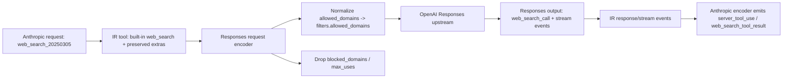

# fix: Restore Claude Web Search compatibility over OpenAI Responses

## Overview

Repair the Claude Code `WebSearch` path when requests enter via Anthropic Messages, transit through llmapimux IR, and exit via OpenAI Responses-compatible upstreams. The immediate request-side failure is now a schema mismatch for `web_search`; after that is fixed, the bridge still needs response and streaming support for OpenAI Responses `web_search_call` items so Anthropic-side callers can observe progress and results.

## Problem Frame

Claude Code emits Anthropic server-tool requests using `web_search_20250305` with top-level fields such as `allowed_domains`, `blocked_domains`, and `max_uses`, plus named `tool_choice` for `web_search`. llmapimux now preserves the built-in tool identity, but it still re-emits Anthropic-shaped fields directly into the OpenAI Responses tool object. That produces outbound JSON shaped like `tools[0].allowed_domains`, which official Responses-compatible handlers reject because OpenAI expects `filters.allowed_domains` for `web_search`.

Separately, llmapimux request handling is now ahead of its response handling. The OpenAI Responses response and stream decoders still only model `message` and `function_call` flows. They do not yet model `web_search_call` output items or the corresponding web-search stream events, and the Anthropic-side content model does not yet have first-class server-tool result blocks. Even after request-side compatibility is restored, Claude Code will remain partially broken unless the response bridge can translate web-search progress and results back into Anthropic-compatible blocks.

## Requirements Trace

- R1. Anthropic `web_search_20250305` requests must encode into valid OpenAI Responses `web_search` tool JSON.
- R2. Claude Code `tool_choice: {type: "tool", name: "web_search"}` must survive conversion without regressing function-tool behavior.
- R3. Unsupported Anthropic-only web search fields must be degraded intentionally instead of being forwarded as invalid OpenAI Responses parameters.
- R4. OpenAI Responses web-search output and stream events must decode into IR and re-encode into Anthropic-compatible server-tool content so Claude Code can observe progress and results.
- R5. Regression coverage must lock down both the request contract and the response/stream bridge for this path.

## Scope Boundaries

- Do not redesign the whole IR around every possible provider-specific built-in tool in one pass beyond what is needed for `web_search` and already-landed `allowed_tools` support.
- Do not add runtime feature flags or target-specific branches in llmapimux unless official OpenAI Responses compatibility proves insufficient.
- Do not treat downstream Codex-specific compatibility as an llmapimux protocol concern; only handle it here if the official mapping cannot pass through the existing downstream translator.

### Deferred to Separate Tasks

- Downstream Codex-only request degradation in CLIProxyAPI, if official OpenAI Responses `web_search` JSON still fails after llmapimux emits the correct schema.
- Support for other built-in tools such as `file_search`, `computer_use`, or `code_interpreter` beyond shared infrastructure already introduced.

## Context & Research

### Relevant Code and Patterns

- `convert_anthropic.go` now preserves Anthropic built-in tools and named tool choice into IR instead of dropping them.
- `convert_openai_responses.go` currently preserves built-in tool identity, but it forwards `Tool.ExtraFields` into Responses request JSON without tool-specific shaping.
- `protocol/openairesponses/request.go` currently stores unknown tool fields generically in `Tool.ExtraFields`.
- `protocol/openairesponses/response.go` and `protocol/openairesponses/stream.go` only model generic response items and do not expose web-search-specific output or stream data.
- `protocol/anthropic/request.go` models request-side tools, but Anthropic content blocks still lack first-class server-tool output block shapes for response translation.
- `integration_test.go`, `convert_openai_responses_test.go`, and `convert_anthropic_test.go` already contain the first wave of built-in tool coverage and should be extended instead of introducing a separate testing style.

### Institutional Learnings

- No relevant `docs/solutions/` artifacts exist in this repository today, so the plan should follow the existing converter and integration-test patterns directly.

### External References

- OpenAI Responses `web_search` uses `filters.allowed_domains` and emits `web_search_call` output and stream events.
- Anthropic `web_search_20250305` carries `allowed_domains`, `blocked_domains`, and `max_uses` as top-level server-tool fields and returns `server_tool_use` plus `web_search_tool_result` blocks.

## Key Technical Decisions

- Normalize Anthropic `allowed_domains` into OpenAI Responses `filters.allowed_domains` during request encoding rather than forwarding the raw Anthropic field layout.
- Drop Anthropic-only `blocked_domains` and `max_uses` when targeting OpenAI Responses, because blindly forwarding them is invalid and there is no confirmed equivalent field in the Responses schema.
- Keep llmapimux responsible for official protocol mapping only; if the downstream Codex adapter rejects valid Responses JSON, patch that behavior in CLIProxyAPI rather than contaminating llmapimux with downstream-specific request shapes.
- Extend the IR and protocol models only as far as needed to represent `web_search_call` output and Anthropic server-tool blocks faithfully enough for Claude Code to function.

## Open Questions

### Resolved During Planning

- Where should Anthropic `allowed_domains` land in Responses JSON: Under `filters.allowed_domains`, matching the official Responses `web_search` schema.
- What should happen to Anthropic `blocked_domains` and `max_uses`: They should be dropped on the Responses outbound path until a supported equivalent is confirmed.
- Where should a downstream Codex-specific compatibility patch live if needed: In CLIProxyAPI, not in llmapimux.

### Deferred to Implementation

- The exact IR representation for web-search result payloads and progress events may need small refinement once the first decoding tests are written against concrete Responses fixtures.
- Whether Anthropic-side result translation needs synthetic content-block lifecycle events beyond the current stream abstractions should be finalized while implementing the stream bridge.

## High-Level Technical Design

> *This illustrates the intended approach and is directional guidance for review, not implementation specification. The implementing agent should treat it as context, not code to reproduce.*

## Implementation Units

- [x] 1. Normalize request-side `web_search` schema for OpenAI Responses
  **Goal**: Ensure Anthropic `web_search_20250305` tools encode into valid Responses `web_search` tool JSON and no longer trigger unknown-parameter failures.
  **Requirements**: R1, R2, R3
  **Dependencies**: None
  **Files**: `convert_openai_responses.go`, `tool_helpers.go`, `protocol/openairesponses/request.go`, `convert_openai_responses_test.go`, `integration_test.go`
  **Approach**: Introduce tool-type-specific request encoding for Responses built-in tools instead of generic `ExtraFields` passthrough. For `web_search`, move `allowed_domains` into `filters.allowed_domains`, preserve any already-valid Responses-native fields such as `search_context_size`, and intentionally omit Anthropic-only fields that do not map cleanly.
  **Execution note**: Start with failing request-encoding and integration tests that capture the correct Responses JSON shape.
  **Patterns to follow**: Keep using the existing converter split in `convert_openai_responses.go` and the request-body assertions already used in `integration_test.go`.
  **Test scenarios**:
  - Anthropic `web_search_20250305` with `allowed_domains` encodes to Responses `tools[0].filters.allowed_domains`.
  - Anthropic `blocked_domains` and `max_uses` are not emitted into the Responses request.
  - Responses-native `search_context_size` survives round-trip for `web_search`.
  - Named built-in `tool_choice` for `web_search` still encodes as `{"type":"web_search"}`.
  - Existing function-tool and `allowed_tools` request tests continue to pass without behavior changes.
  **Verification**: The request encoder and Anthropic-to-Responses integration test both assert the new schema, and the previous unknown-parameter failure is no longer reproducible against a strict Responses validator.

- [ ] 2. Validate the official request mapping against the real downstream chain
  **Goal**: Confirm whether llmapimux’s official Responses schema is sufficient for the existing `gocc -> CLIProxyAPI -> Codex` chain.
  **Requirements**: R1, R2, R3
  **Dependencies**: Unit 1
  **Files**: `docs/plans/2026-04-19-001-fix-web-search-responses-compatibility-plan.md`
  **Approach**: Re-run the real Claude Code `Web Search` scenario after Unit 1 lands. If the error moves downstream and indicates Codex-specific incompatibility with valid Responses `web_search` JSON, capture that as a separate integration boundary and patch CLIProxyAPI in a follow-up execution step.
  **Patterns to follow**: Use the same real-session validation loop that surfaced the original `tool_choice` and `allowed_domains` failures.
  **Test scenarios**:
  - Real chain accepts the corrected request shape with no request-schema rejection.
  - If downstream still rejects the request, the new failure points to a downstream-specific field or contract instead of llmapimux request encoding.
  **Verification**: A real `Web Search "qwer1234"` run either succeeds past request validation or produces a downstream-specific failure that clearly justifies a CLIProxyAPI patch.

- [x] 3. Model OpenAI Responses `web_search_call` output and stream events
  **Goal**: Give llmapimux enough response-side structure to decode Responses web-search activity into IR.
  **Requirements**: R4, R5
  **Dependencies**: Unit 1
  **Files**: `protocol/openairesponses/response.go`, `protocol/openairesponses/stream.go`, `convert_openai_responses.go`, `convert_openai_responses_test.go`
  **Approach**: Extend the Responses protocol models with the fields required for `web_search_call` output items and the `response.web_search_call.*` stream events. Teach the decoder to turn completed output items and stream event progress into dedicated IR content and stream deltas instead of silently skipping them.
  **Execution note**: Add characterization tests first using concrete `web_search_call` payloads and stream fixtures.
  **Patterns to follow**: Reuse the existing message/function-call decode flow and the current `response.output_item.*` stream-event handling style.
  **Test scenarios**:
  - A completed Responses `web_search_call` output item decodes into IR with preserved identifiers and result payload.
  - `response.web_search_call.in_progress` and `response.web_search_call.searching` stream events decode into IR progress events without being dropped.
  - Existing `message` and `function_call` response decoding remains unchanged.
  **Verification**: New response and stream tests assert that web-search items are no longer ignored and that legacy response cases still pass.

- [x] 4. Re-encode web-search responses into Anthropic-compatible server-tool blocks
  **Goal**: Deliver Claude Code the server-tool block shapes it already expects for web-search progress and results.
  **Requirements**: R4, R5
  **Dependencies**: Unit 3
  **Files**: `message.go`, `protocol/anthropic/request.go`, `convert_anthropic.go`, `convert_anthropic_test.go`, `integration_test.go`
  **Approach**: Add the minimal IR and Anthropic content-model support needed for `server_tool_use` and `web_search_tool_result`, then map decoded Responses web-search activity into those blocks for both non-streaming and streaming Anthropic responses.
  **Execution note**: Prefer characterization-first tests because this bridge needs to match Claude Code’s observed parsing expectations rather than a generic Anthropic abstraction.
  **Patterns to follow**: Mirror the existing Anthropic `tool_use` / `tool_result` conversion style while preserving the distinct server-tool block names and payload shapes required by Claude Code.
  **Test scenarios**:
  - Non-streaming Responses web-search output re-encodes into Anthropic content containing `server_tool_use` and `web_search_tool_result`.
  - Streaming Responses web-search events emit Anthropic content-block lifecycle and delta events that allow progressive query/result updates.
  - Existing Anthropic function-tool conversions remain unchanged.
  **Verification**: Anthropic-side unit and integration tests assert the server-tool block shapes Claude Code expects.

- [x] 5. Run full regression verification and only patch downstream compatibility if the real chain still rejects valid Responses JSON
  **Goal**: Finish with a verified llmapimux fix and a crisp boundary for any remaining downstream work.
  **Requirements**: R1, R2, R3, R4, R5
  **Dependencies**: Units 1 through 4
  **Files**: `convert_openai_responses_test.go`, `convert_anthropic_test.go`, `integration_test.go`
  **Approach**: Run targeted converter/integration suites first, then `go test ./...`. After llmapimux is green, validate the real `gocc` chain again. Only if the real chain still fails for a downstream-specific reason should execution move into CLIProxyAPI.
  **Patterns to follow**: Use the repository’s existing unit-plus-integration layering and keep real-chain validation separate from Go test assertions.
  **Test scenarios**:
  - Focused request-side tests pass after Unit 1.
  - Response and stream bridge tests pass after Units 3 and 4.
  - `go test ./...` passes for the whole repository.
  - Real-chain validation either succeeds or isolates the remaining gap to CLIProxyAPI with a concrete new error.
  **Verification**: llmapimux test suites are green and the next failing boundary, if any, is outside this repository.

## Risks and Mitigations

- Risk: Request-side official Responses mapping is correct but still rejected by downstream Codex translation.
  Mitigation: Keep llmapimux aligned to official schema and treat any remaining incompatibility as a CLIProxyAPI concern with a separate patch.
- Risk: Response-side IR changes accidentally perturb existing function-tool behavior.
  Mitigation: Extend the existing converter tests instead of adding isolated tests that miss regressions.
- Risk: Streaming event mapping may require synthetic Anthropic lifecycle events to satisfy Claude Code accumulation logic.
  Mitigation: Base the bridge on concrete Claude Code expectations and add stream fixture tests before changing encoder logic.

## System-Wide Impact

- Claude Code users routed through `gocc` and llmapimux should regain `WebSearch` compatibility on Responses-compatible profiles.
- Downstream proxies such as CLIProxyAPI get a cleaner contract boundary: llmapimux emits official Responses JSON, and any remaining Codex-specific degradation can be localized there.
